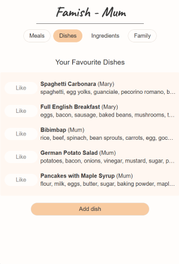
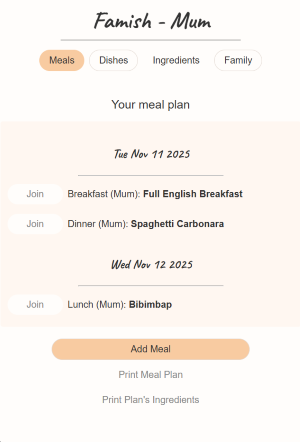

# Famish

Happy meals for every family member

## What and Why

Managing a family is a full-time job. Planning out a week's meals is a challenge. Famish helps you.

* Join or start a family
* Add your favorite dishes
* Plan the week's meals
* Share the plan (coming soon)
* Get feedback from family members (coming soon)
* Use your plan to get all ingredients (coming soon)

## Getting Started

The app is accessible [here](https://famish-app.netlify.app).
Planning materials are [in this Google Doc](https://docs.google.com/document/d/1eULqOPd_jFgmJ7BPXO-P523pcTqeLTUj-1E-g5mDJGc/edit?usp=sharing) with links to Trello for backlog management and Miro for wireframing.

You can run the app on your local device from this repository with the following steps:
1. `git clone <URL>` to retrieve the source code.
1. `cd famish` to change into the cloned directory.
1. `npm install` to download all required packages (see below)
1. `node server.js` to start the server on port 3000
1. Use your browser to [access the app](http://localhost:3000/)

## Technologies Used

Famish is based on Node, Express and MongoDB using JavaScript. The following packages are employed:
    
* "express": Use Express to operate the web server's middleware and routes.
* "ejs": Render HTML files dynmically with Embeded JavaScript.
* "express-session": Manage the user session's data
* "connect-mongo": Use MongoDB to persistent session data, esp. for authorization
* "mongoose": Persiste data on MongoDB with simple schemas.
* "dotenv": Access environment variables (like MongoDB URI) in .env
* "bcrypt": Hash the user's password during authorization
* "method-override": Handle DELETE, PUT, ... from HTML forms
* "morgan": Log requests to the server
* "serverless-http": Required to operate the server on Netlify

There are additional development dependencies for linting.

## Next Steps

There are several directions for extending Famish:

* _Ingredients_: Instead of storing a dish's ingredients as a text, users could pick them from a set of defined ingredients. This would require a database of ingredients which can be extended with additional information, in particular:
    * Dietary information to manage a week's intake on proteins, carbs, ...
    * Purchase information for ingredients (e.g., specify a local store to buy from). This is a route for monetitazion, as the information can be used for ads.
* _Offline_: Print a week's meals (and its ingredients) for pinning it onto the fridge (for going to the supermarket).
* _Community_: Get inspired from other users' dishes and meals. For instance, a user could publish a dish and other could add the dish to their meal list.
* _AI_: Instead of relying on the community, use AI to get new dishes, or add entries faster (e.g., provide a recipe link and auto-complete the ingredients). This is likely simpler to maintain than _Community_.

These directions are independent of each other but can be combined easily for more user value.